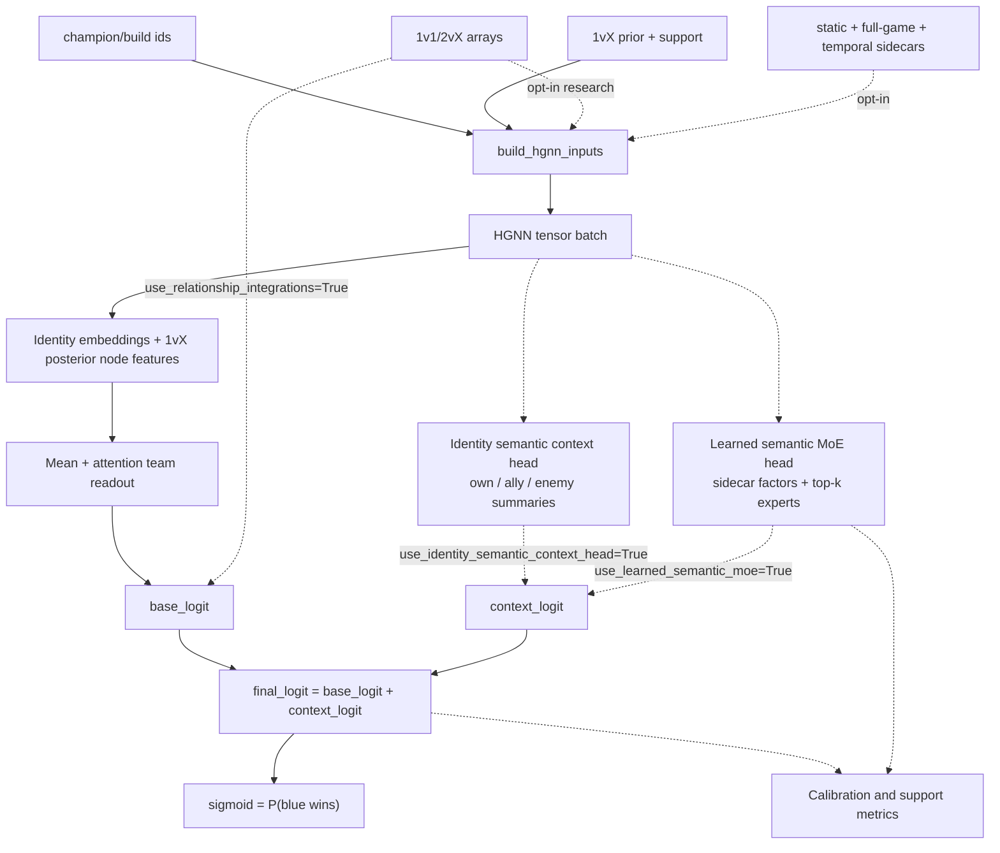
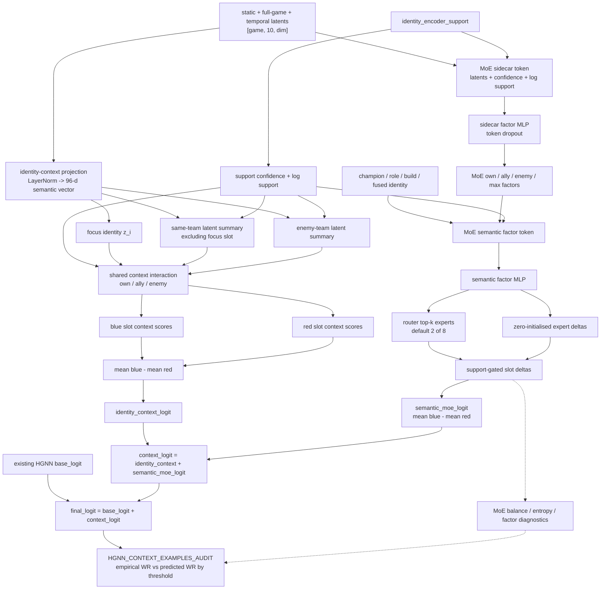

# HGNN Current State

Last updated: 2026-06-03.

## Production Path

Default training and serving use the 1vX player prior, champion/build identity
embeddings, and team-swap augmentation. Legacy classification-derived semantic,
profile, and context inputs are no longer part of `build_hgnn_inputs()` or
`HGNNWinModel.forward()`.

Identity signal beyond the champion/build embeddings is now carried by the
disabled-by-default identity-encoder sidecars (static / full-game / temporal),
plus opt-in semantic-context heads over those same frozen latent blocks: the
identity summary head and the learned semantic MoE head. See
[Identity Encoder Sidecars](#identity-encoder-sidecars).

```text
cache 1vX priors + support
-> posterior node features
-> champion/build identity embeddings
-> optional frozen identity sidecars / semantic context or MoE head
-> blue/red team readout
-> final logit
-> sigmoid = P(blue wins)
```

Direct 1v1 and 2vX integrations are disabled by default. The loader still
accepts existing relationship arrays, and `build_hgnn_inputs()` creates neutral
internal placeholders when they are absent. Older model artifacts without an
explicit `use_relationship_integrations` flag load with relationship
integrations preserved.

## Architecture



## Identity Encoder Sidecars

Three standalone identity autoencoders produce latents that can be injected as
node-level sidecars in `HGNNWinModel`. The sidecar artifact is one row per
`(champion, role, build)` identity; the static block is champion-level and is
joined/repeated onto those rows, while full-game and temporal latents are native
to the full identity grain.

The latents are **not** materialised per game-slot. The cache (`v28`) records the
artifact path/dims only; `app/ml/train.py` builds an on-device gather table
(`EncoderSidecarLookup.gather_tables`) and gathers `(batch, 10, dim)` blocks per
batch from `champion_id`/`build_id` — the static block is keyed by champion. This
collapses the sidecar cache from tens of GB to the few-MB frozen artifact. The
draft-time predictor already gathered the same way. Legacy caches that still hold
per-game sidecar arrays continue to load and are used directly.

| Sidecar | Encoder module | Config flag (default `False`) |
| --- | --- | --- |
| Static | [classification/static_identity_encoder.py](../../classification/static_identity_encoder.py) | `use_identity_static_sidecar` |
| Full-game | [classification/full_game_encoder.py](../../classification/full_game_encoder.py) | `use_identity_full_game_sidecar` |
| Temporal | [classification/temporal_autoencoder.py](../../classification/temporal_autoencoder.py) | `use_identity_temporal_sidecar` |

The sidecar MLP is support-gated and zero-initialised, so an unwired or
low-support latent is a no-op on the production node init. All three are off by
default; the ablation surface lives in
[../experiments/context_ablation.py](../experiments/context_ablation.py).

`HGNNConfig.use_identity_semantic_context_head=True` enables a separate
zero-initialised context logit over the frozen static, full-game, and temporal
blocks. For each slot it projects the concatenated latents, builds support-
weighted **mean** summaries of the other four allies and five enemies plus
**extremity (max)** summaries, scores the shared `own / ally / enemy`
interaction, and adds `context_logit` to `base_logit`. The max summaries preserve
convex composition signal ("3 burst threats") that mean pooling averages away. A
learned scalar `context_scale` (init 1.0, a no-op at init because the score head
is zero-initialised) lets the optimiser grow the context correction, countering
the systematic effect-shrinkage seen in the audit. The model returns all three
columns: `base_logit`, `context_logit`, and `final_logit`.

Two report-only tuning knobs target the same audit gap without per-grouping
fitting: `--auc-ranking-loss-weight` (ranking loss that weights rare extreme
contexts equally with the common middle) and `--semantic-context-support-strength`
(lower to amplify context magnitude). Both default off/30.

`HGNNConfig.use_learned_semantic_moe=True` enables the learned mixture-of-experts
context path over the same required sidecar inputs plus the champion, role,
build, and fused identity embeddings. It builds support/log-support sidecar
tokens, derives own / ally / enemy / extremity factors, routes each slot through
top-k experts (default 2 of 8), support-gates zero-initialised slot deltas, and
adds `semantic_moe_logit` into `context_logit`. It can run alone or alongside the
identity semantic context head; training consumes `semantic_moe_regularization_loss`
and reports router usage, entropy, factor diversity, token-dropout, and delta
diagnostics. The ablation variants are `learned_semantic_moe_only` and
`all_three_plus_learned_semantic_moe`.

When `use_semantic_group_features=True`, the learned MoE also receives the
compact semantic group feature tensor from `app/ml/semantic_group_features.py`.
The relationship head builds slot-level own / ally / enemy group summaries
including mean, sum, max, ally-vs-enemy differences, and own-by-team interaction
blocks. A zero-initialised MLP turns those relationship blocks into support-gated
slot deltas, so the production prior is unchanged at init while identities can
slowly learn how their own semantic groups react to every allied and enemy group
composition. Diagnostics expose the relationship logit, slot-delta norm,
coefficient norm, context norm, and optional L2 penalty.

Since the context audit is slot-specific, checkpoints with MoE slot deltas are
now audited with focus-side probabilities rather than one repeated match-level
probability. Blue slots are scored in the blue frame; red slots are scored in the
mirrored red frame. `--semantic-context-calibration-loss-weight` adds a
slot-aware calibration objective over the same audit specs, with stable
train-split empirical targets and optional tail weighting, so gradients flow
directly into semantic slot deltas. The best audit-focused run so far is
`app/ml/data/experiments/semantic_focus_reference_w3000_cont6/model.pt`, with
Gap MSE `1.16 pp^2`, mean absolute gap `0.75 pp`, and max absolute gap
`4.76 pp` on the checked-in audit.

### Semantic Context Plan



## Maintained Surfaces

| File | Purpose |
| --- | --- |
| [../hgnn_model.py](../hgnn_model.py) | HGNN model, input builder, swap invariants, and relationship gate. |
| [../encoder_sidecar.py](../encoder_sidecar.py) | Identity-encoder latent loading, per-game lookup, and dedup gather tables. |
| [../build_dataset.py](../build_dataset.py) | Cache builder for 1vX identity inputs and optional relationship arrays (records the sidecar artifact; does not materialise it). |
| [../dataset.py](../dataset.py) | Cache loader and split dataclass. |
| [../train.py](../train.py) | Production training and validation/report-only calibration diagnostics. |
| [../predictor.py](../predictor.py) | Draft-time runtime bridge. |

## Active Defaults

| Area | Default |
| --- | --- |
| Checkpoint metric | `val_threshold_accuracy` |
| Report-only temperature scaling | Fit on validation logits only; never changes served probabilities. |
| Direct 1v1/2vX integrations | Disabled by default. |
| Relationship loader arrays | Retained for explicit research use. |
| Identity-encoder sidecars (static/full-game/temporal) | Disabled by default. |
| Identity semantic context head over all three identity sidecars | Disabled by default. |
| Learned semantic MoE head over all three identity sidecars | Disabled by default. |
| Semantic group features and relationship head | Disabled unless `use_learned_semantic_moe=True` and `use_semantic_group_features=True`. |
| Semantic context calibration loss | Disabled by default; research/audit optimization only. |

Invalid calibration and training config combinations fail early in
`app/ml/train.py`. Test labels are not used for threshold selection,
temperature fitting, checkpoint selection, or model selection.
