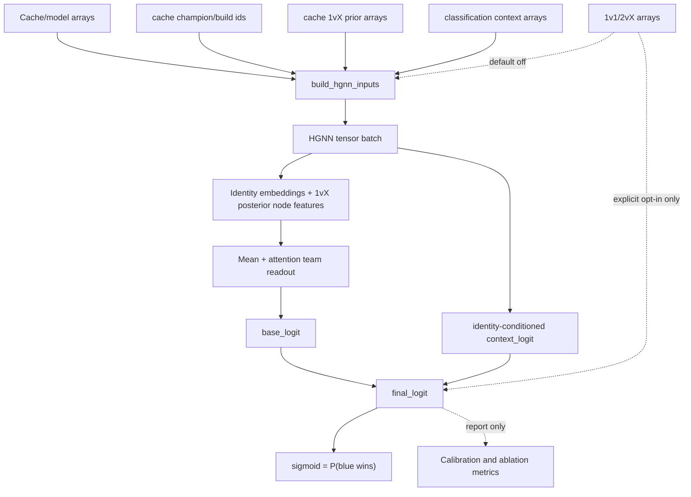
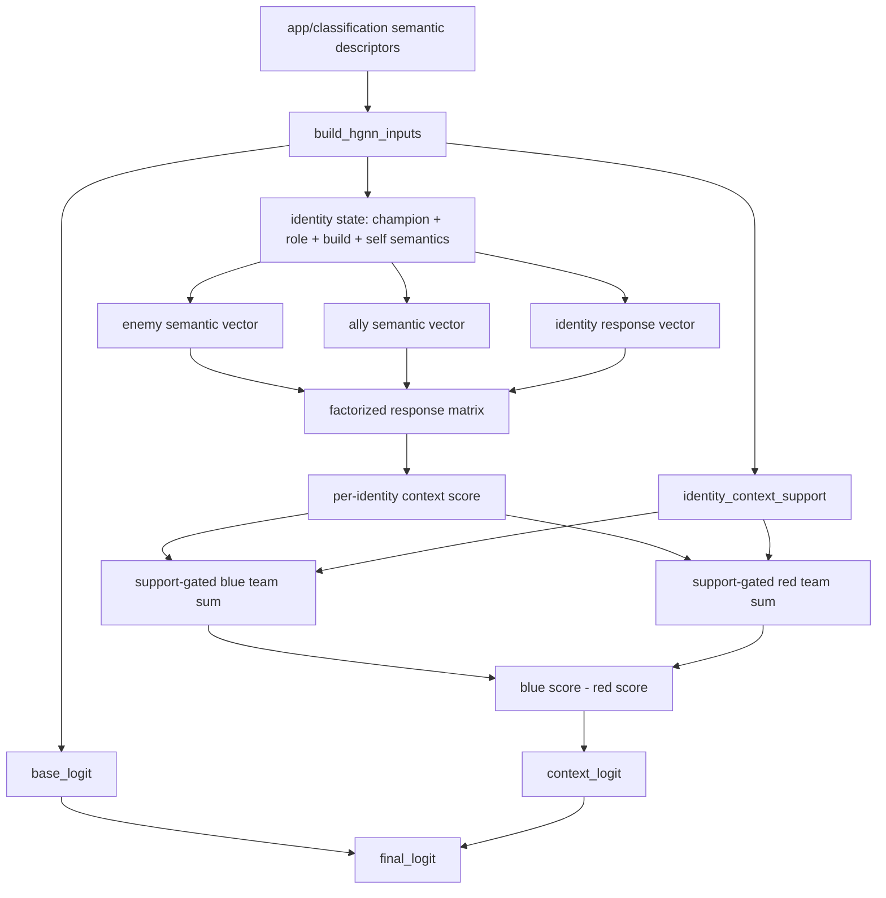
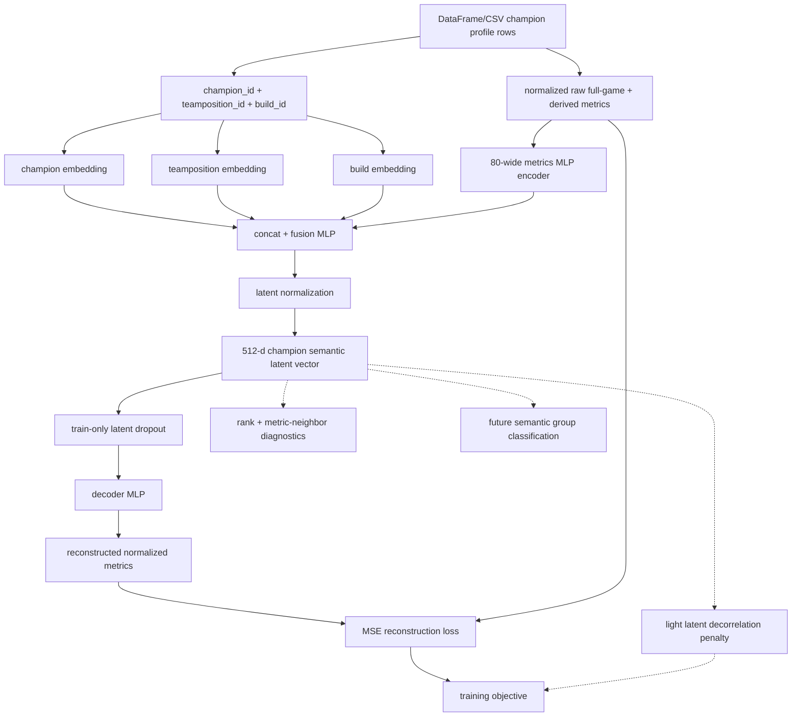

# HGNN Current State

Last updated: 2026-06-02.

## Production Path

Default training and serving use the 1vX player prior, champion/build identity
embeddings, team-swap augmentation, and the raw identity-conditioned context
head. Direct 1v1 and 2vX integrations are disabled by default.

```text
cache 1vX priors + support
-> posterior node features
-> champion/build identity embeddings
-> blue/red team readout
-> raw identity-conditioned context residual
-> final logit
-> sigmoid = P(blue wins)
```

The loader still exposes `matchup_1v1`, `synergy_2vx`, `m1v1_cnt`, `s2vx_cnt`,
`m1v1_eff_n`, and `s2vx_eff_n` for future research and older artifacts. The
default train path drops those arrays before tensor caching; the default runtime
predictor skips relationship prior lookups. Older artifacts without an explicit
`use_relationship_integrations` flag load with relationship integrations
preserved.

## Generic Architecture



## Semantic Context Target



## Champion Semantic Autoencoder Baseline



The target semantic context question is: `Identity A performed this well against
these enemy semantic groups, given these ally semantic groups were on their
team.` A compact matrix form can express this as an identity-conditioned
interaction between an enemy semantic vector and an ally semantic vector, for
example `score_i = enemy_semantics^T W_i ally_semantics`. In practice `W_i`
should be factorized through a small bottleneck, such as
`dot(identity_view, enemy_view * ally_view)`, then reduced to one context score
per identity before the support-gated blue-minus-red team subtraction.

Maintained iteration surfaces:

| File | Purpose |
| --- | --- |
| [../train.py](../train.py) | Production training and validation/report-only calibration diagnostics. |
| [../hgnn_model.py](../hgnn_model.py) | HGNN model, input builder, swap invariants, and legacy relationship gate. |
| [../experiments/context_ablation.py](../experiments/context_ablation.py) | Generic ablation runner and machine-readable leaderboard. |
| [../context_examples_audit.py](../context_examples_audit.py) | Generic context example audit reproducer. |
| [HGNN_CONTEXT_EXAMPLES_AUDIT.md](HGNN_CONTEXT_EXAMPLES_AUDIT.md) | Human-readable context example report. |

## Active Defaults

| Area | Default |
| --- | --- |
| Checkpoint metric | `val_threshold_accuracy` |
| Report-only temperature scaling | Fit on validation logits only; never changes served probabilities. |
| Context support calibration report | Optional CLI flag; validation-only fitting. |
| Identity-conditioned context | Enabled, low-rank, raw context source. |
| Direct 1v1/2vX integrations | Disabled by default. |
| Relationship loader arrays | Retained for future/legacy use. |

Invalid calibration and training config combinations fail early in
`app/ml/train.py`. Test labels are not used for threshold selection,
temperature fitting, checkpoint selection, or model selection.

## Iteration Note: Remove 1v1/2vX Integrations

Weakness addressed: direct 1v1/2vX tensors added production complexity and
relationship-specific audit clutter while recent evidence showed accuracy/AUC
impact below the requested `0.005` significance bar.

Change implemented: `HGNNConfig.use_relationship_integrations` now defaults to
`False`. Training drops relationship tables before tensor caching, runtime
prediction skips relationship lookups for default artifacts, and
`build_hgnn_inputs()` accepts missing relationship arrays by creating neutral
internal placeholders. The loader contract is unchanged for future research.

Why it should help: removing a low-impact relationship path makes model outputs
easier to audit and keeps future work focused on context representation,
calibration, and subgroup robustness. Any future relationship reintroduction has
to be explicit in config and visible in experiment leaderboards.

Evidence added:

- Existing AUC-checkpoint audit: no-relationship versus relationship baseline was
  `+0.00019` validation AUC and `-0.00003` test AUC.
- Existing `val_nll_ece` audit over two seeds: no-relationship averaged
  `-0.00366` validation raw accuracy, `-0.00065` validation threshold accuracy,
  `-0.00158` validation AUC, and `-0.00144` test AUC.
- Active post-removal seed-0 `val_nll_ece` verification:
  `use_relationship_integrations=False`, validation threshold accuracy
  `0.57746`, validation AUC `0.60074`, test threshold accuracy `0.57319`, and
  test AUC `0.59539`. Versus the prior seed-0 relationship-enabled
  `val_nll_ece` run, validation AUC moved `-0.00067` and test AUC moved
  `-0.00181`, both below `0.005`.
- New tests assert relationship tables are dropped before default tensor caching,
  missing relationship arrays build neutral inputs, relationship features are
  explicit opt-in tensors, and leaderboards record `use_relationship_integrations`.

Remaining risk: removal worsened calibration in the same two-seed
`val_nll_ece` audit: validation ECE increased by about `+0.00790` and test ECE
by about `+0.00813`. Served probabilities remain raw/report-only calibrated, so
future iterations should watch calibration and subgroup support gaps closely.

Recommended next iteration: recover the lost calibration without reintroducing
default 1v1/2vX data, preferably through validation-only calibration diagnostics
or support-aware context regularization.

## Iteration Note: Remove Prior Shortcut

Weakness addressed: the 1vX prior was consumed both as posterior node evidence
and as a separate learned shortcut into the match logit, making it harder to
audit whether improvements came from identity/context modelling or shortcut
capacity.

Change implemented: the HGNN no longer builds or calls a direct prior shortcut.
The 1vX hierarchy still enters through `build_hgnn_inputs()` as `mu_1vx`,
variance, confidence, and log-count features for each player node.

Why it should help: this makes the architecture simpler and forces any future
prior-baseline change to be explicit, such as a measured deterministic prior
offset or residual model.

Evidence added: model tests now assert the shortcut modules are absent, and
context-ablation variant tests assert experiments do not reintroduce shortcut
capacity through hidden overrides.

Remaining risk: removing the shortcut changes newly trained model capacity and
may reduce AUC until an explicit hierarchical prior-offset baseline is measured.

Recommended next iteration: compare the no-shortcut HGNN against a deterministic
hierarchical-prior-offset residual variant and report AUC, NLL, ECE, and
swap-antisymmetry deltas.

## Iteration Note: Drop Max Team Pool

Weakness addressed: the team readout mixed mean, max, and attention summaries,
adding capacity before measuring whether max pooling provided distinct signal.

Change implemented: each team vector is now projected from the concatenated
team mean and learned attention pool only. The main head still receives exactly
the blue team vector, red team vector, their difference, their product, and the
relationship residual placeholder or explicit opt-in residual.

Why it should help: removing max pooling makes the readout less redundant and
keeps the base logit easier to reason about while preserving a stable average
signal and a learned slot-weighted signal.

Evidence added: tests now assert the readout uses only mean plus attention and
that `base_logit` is built from two team vectors combined as
`blue`, `red`, `blue - red`, and `blue * red`.

Remaining risk: max pooling may have captured rare standout-player effects that
attention does not recover during training.

Recommended next iteration: run a readout ablation comparing
`mean+attention`, `attention_only`, and a deterministic prior-offset residual
model on AUC, NLL, ECE, and support-sliced calibration.

## Iteration Note: Remove 1vX Missing Flag

Weakness addressed: the node-prior encoder consumed both confidence/log-count
and a redundant missingness flag, even though `p1_cnt == 0` already maps to
`conf_1vx == 0` and `log_count_1vx == 0`.

Change implemented: `build_hgnn_inputs()` no longer emits `missing_1vx`, and the
1vX posterior encoder now conditions on `mu_logit`, variance, confidence, and
log-count only. Relationship missing flags remain only for explicit opt-in
relationship feature experiments.

Why it should help: this removes one redundant confidence channel from the
production node prior path and makes the support contract easier to audit.

Evidence added: tests assert zero-count 1vX support is represented by
confidence/log-count alone and that the 1vX encoder cannot consume a missingness
input.

Remaining risk: a separate missing flag may have been useful if the model learned
a discontinuity between zero support and tiny nonzero support.

Recommended next iteration: use the new variance ablation to test whether the
posterior variance term still adds useful uncertainty signal.

## Iteration Note: Measure 1vX Variance Redundancy

Weakness addressed: after removing the redundant 1vX missing flag, the remaining
uncertainty path still had `var_1vx`, confidence, and log-count. It was unclear
whether variance carried distinct signal once support features were present.

Change implemented: added explicit `HGNNConfig.use_1vx_posterior_variance`.
Production keeps the default `True`. The new `low_rank_no_1vx_variance`
ablation sets it to `False`, which removes variance and precision from the 1vX
encoder input dimensions rather than only zeroing the tensor.

Why it should help: the comparison now isolates posterior variance as a model
capacity question while preserving the served path. It also avoids treating
context support as a proxy for prior-support uncertainty.

Evidence added: training metrics now include `prior_1vx_support` buckets from
`p1_cnt`, with per-bucket AUC, ECE, Brier, and calibration gap. The context
ablation leaderboard records the variance flag plus 1vX support-sliced maximum
calibration gap and minimum support-bucket AUC.

Smoke measurement: a tiny `--max-games 10 --max-epochs 1` probe compared
`current_mean_low_rank` against `low_rank_no_1vx_variance`. Removing variance
moved validation AUC from `0.56` to `0.40`, test AUC from `0.619` to `0.143`,
test 1vX support minimum-bucket AUC from `0.611` to `0.167`, and did not improve
support-sliced calibration gap. This is not production evidence, but it says not
to remove variance blindly.

Remaining risk: the smoke probe is intentionally tiny and high variance; a full
multi-seed ablation is still needed before changing defaults.

Recommended next iteration: run `current_mean_low_rank` versus
`low_rank_no_1vx_variance` on the full cache with repeated seeds and make the
decision on validation AUC, validation NLL/ECE, and validation 1vX
support-sliced AUC/gap, using test only as final reporting.
