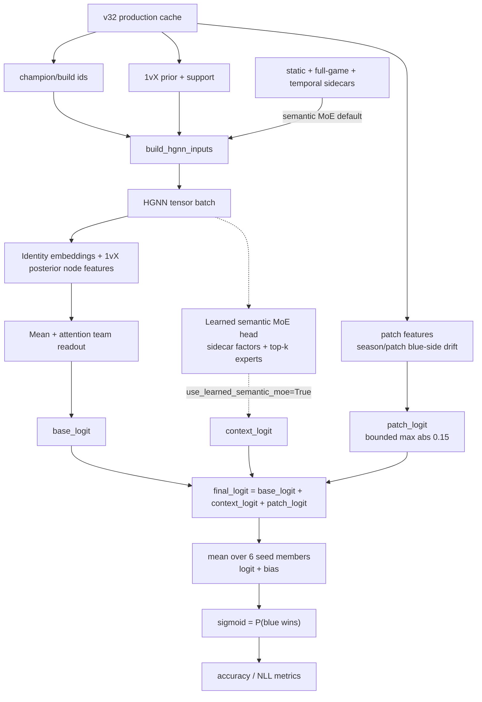
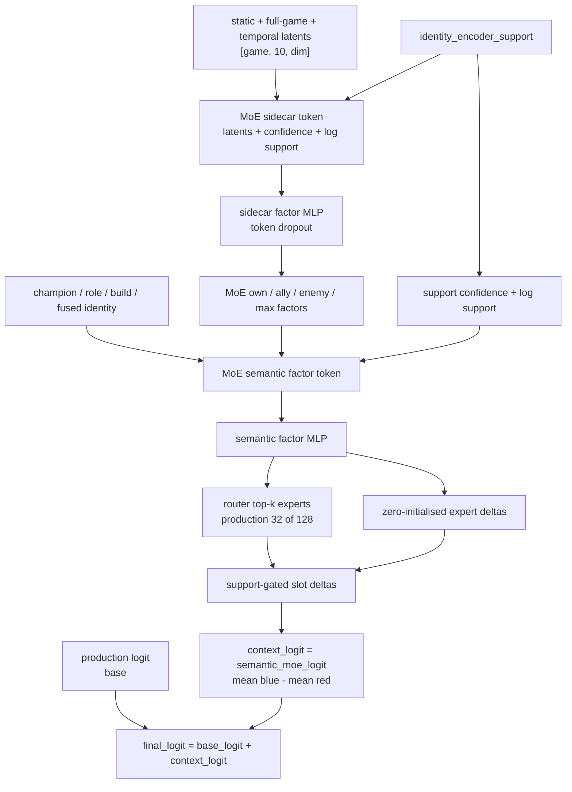

# HGNN Current State

Last updated: 2026-06-14 00:59 BST.

The model is draft-generic by hard constraint: no player information of any
kind (no puuids, no player priors, no rank). The admissible surface is
champions, positions, bans, train-only build catalogs or hypothesised
build-worlds, and season/patch metadata only when a real draft-time provider is
bound at serving. Observed final `build_id` remains an oracle diagnostic, not
pregame-visible data.

## Split Protocol (v32)

`ml_game_split` labels are per-patch chronological 80/20 train/test — games
are partitioned by `(season, patch)`, ordered by game start, and each patch's
first 80% goes to train with the remainder to test. There is no validation
split; test is the model-selection split for checkpoint selection and
accuracy/NLL reporting, not a final untouched holdout. The cache format is
`npy-memmap-v32`; older validation-bearing caches must be rebuilt. This makes
same-patch history available to train-side priors and features before each
patch's scored tail.

Protocol validation (2026-06-11): the ClickHouse split, pivot, and
split-scoped aggregates were rebuilt (`1,318,329` train / `329,586` test, 11
patches all at 80/20) along with the v32 cache, and three default-recipe seeds
were trained. Single-seed test accuracy is `0.5784`–`0.5792` (mean `0.5788`,
stdev `0.0004`) with test NLL `0.6719`–`0.6727` — recovering the old
protocol's validation level and beating its frozen-tail test by `+0.50pp`
accuracy and `-0.0037` NLL. The old val-over-test gap was freshness, and the
per-patch split removes it: per-patch test accuracy spans only
`0.5742`–`0.5819` (at the binomial sampling floor per patch), and accuracy
across chronological quartiles of each patch's test tail is flat, so no
measurable within-patch freshness decay remains. Remaining headroom is
model/feature, not split mechanics; cross-patch train weighting is still an
open, untested lever.

Follow-up draft-only residual probes (see EXPERIMENTS.md, 2026-06-11) found
two bankable levers — a 3-seed ensemble (`+0.26pp` acc, `-0.0011` NLL over a
refit single seed) and a train-fitted side intercept the swap-augmented model
cannot express — and otherwise no linear or shallow-nonlinear residual in
bans, encoder latents, or role-aligned lane diffs; the stable hard core is
well-covered balanced drafts, not a data blind spot. Both levers are now
promoted (see Production Status).

## Production Path

Default training and evaluation use the 1vX champion-role/build prior, champion/build identity
embeddings, the promoted learned semantic MoE over all three frozen identity encoders
(`static`, `full_game`, and `temporal`), and team-swap augmentation. Legacy
classification-derived semantic, profile, and context inputs are no longer part
of `build_hgnn_inputs()` or `HGNNWinModel.forward()`.

The promoted semantic path is the fixed learned MoE over static, full-game, and
temporal sidecar latents plus compact semantic group features. Production
capacity is 128 experts with `top_k=32`. See
[Identity Encoder Sidecars](#identity-encoder-sidecars).

Serving through `app.ml.predictor.load_predictor()` supplies champions, roles,
and hypothesised build ids — exactly what the `app.rl.reward.Predictor`
protocol provides per world. Patch-head checkpoints also require
`serving_patch=(season, patch)` or an explicit `PatchFeatureProvider`, which
serves a train-only, player-agnostic season/patch blue-side prior known at draft
time. Missing patch features fail at load time instead of being zero-filled. No
loadout, summoner-spell, or rune input remains in the contract. The model stays
**RL-servable** only when every checkpoint-required input has a draft-time
provider story.
`WinRatePredictor.predict_marginal` additionally serves the pregame path: it
takes no build ids, enumerates train-supported build worlds from the
`app.ml.build_catalog` priors, and averages output probabilities (see
`HGNN_BUILD_INTENT.md` and the marginalisation record in `EXPERIMENTS.md`).
Accepted marginal *metrics* come from the cache-side harness
`python -m app.ml.marginal_eval`.

```text
cache 1vX priors + support
-> posterior node features
-> champion/build identity embeddings
-> frozen static/full-game/temporal sidecars into learned semantic MoE
-> blue/red team readout
-> per-seed final logit, mean over 6 seeds
-> bias-only calibration (+ blue-side intercept)
-> sigmoid = P(blue wins)
```

Direct 1v1/2vX champion matchup and synergy relationship integrations, and the
experimental player-prior arrays, have been removed from the model contract,
cache layout, priors, and predictor. Older local cache directories may still
contain ignored relationship or player `.npy` files, but v32 production
loading does not declare or consume them.

## Production Status

Hard acceptance remains overall raw test accuracy `>=60%` on the per-patch
test split. The current promoted production artifact does not meet that gate
yet, but it banks every validated draft-only lever.

Promoted artifact: `app/ml/data/hgnn_production_model.pt` — a calibrated
6-seed ensemble written by `app/ml/promote.py`. Each member is a
default-recipe v32 checkpoint (seeds 4-9: lr `3e-4`, batch `16384`,
`max_epochs=40`, `patience=5`, raw test-accuracy checkpointing). Promotion
averages the per-seed logits and fits a bias-only logit calibration on the
train split (scale fixed at `1.0`); the bias restores the blue-side prior
that team-swap augmentation suppresses (model mean `p≈0.493` vs true blue
winrate `0.482`). A train-fitted scale is in-sample-optimistic and overshoots
on test — see the 2026-06-12 record in `EXPERIMENTS.md`.

| Promoted ensemble | Test accuracy | Test NLL | logit scale | logit bias |
| --- | ---: | ---: | ---: | ---: |
| 6-seed logit-mean + bias-only calibration | **57.7968%** | **0.672385** | `1.0` | `-0.0535` |
| Pre-restore loadout+patch ensemble (historical) | `58.3669%` | `0.669642` | `1.0` | `-0.0488` |
| Single-seed reference (mean of seeds 4-9) | `57.37%` | `0.6748` | — | — |

The promoted ensemble row is an observed-build/oracle diagnostic: it scores the
cached final `build_id` and is not the accepted pregame number. The
leakage-free accepted path is build marginalisation from the train-only build
catalog. The current observed-build artifact is the patch-restored,
loadout-removed 6-seed ensemble (2026-06-13): re-adding only the season/patch
blue-side head recovered `+0.035pp` accuracy / `-0.0003` NLL over the
patch-free ensemble (`57.762%` / `0.67267`); the larger gap to the
pre-restore loadout+patch artifact (`58.3669%` / `0.669642`) was the
summoner-spell/rune loadout head, removed permanently as measured noise.
Accepted pregame rescoring did not clear gates: the patch-restored seed-9
`W=128,k_slot=3` marginal rescore was `55.0752%` / `0.685092` raw, and the
current artifact's raw `W=512,k_slot=3` catalog sweep was `55.4529%` /
`0.683566`. Both are below the modal floor and the accepted W=128 baseline.

| Prediction path | Build source | Artifact | Test accuracy | Test NLL |
| --- | --- | --- | ---: | ---: |
| Observed-build oracle diagnostic | cached final `build_id` | Current 6-seed bias-only ensemble | `57.7968%` | `0.672385` |
| Leakage-free pregame marginal (`W=128`, `k_slot=3`) | train-only `P(build \| champion, role)` catalog | Accepted 6-seed asset-separation baseline | `56.3064%` raw / `56.3079%` calibrated | `0.680652` raw / `0.680773` calibrated |
| Leakage-free modal baseline (`W=1`) | train-only top build per slot | Accepted 6-seed asset-separation baseline | `55.8589%` raw / `55.9265%` calibrated | `0.682588` raw / `0.682705` calibrated |
| Rejected catalog sweep (`W=512`, `k_slot=3`) | train-only `P(build \| champion, role)` catalog | Current patch-head artifact | `55.4529%` raw | `0.683566` raw |

Gate reachability (2026-06-10, reaffirmed 2026-06-13): the historical
single-slot/context axes have been audited — context head saturated at the
draft-time ceiling, old direct relationship features dead, recency/level dead,
role experience marginal, player-skill priors now excluded outright by the
draft-generic constraint, champion-strength / meta-drift features bounded out
by a leakage-free future-knowledge oracle (`<=0.005pp` ceiling), and
`(champion, position)` semantic identity profiles shown fully redundant with
champion identity by shuffled-profile and one-hot controls (see
`EXPERIMENTS.md` for each record). Remaining headroom most plausibly requires
new train-only aggregate structure, with higher-order draft relation residuals
the next low-cost probe.

Under the current leakage policy, observed final build-value/profile residuals
remain diagnostic only unless an allowed train-only catalog, marginal world, or
RL candidate source supplies the build intent (see `HGNN_BUILD_INTENT.md`).

## Architecture



## Identity Encoder Sidecars

Three standalone identity autoencoders produce latents consumed by the learned
semantic MoE. The sidecar artifact is one row per
`(champion, role, build)` identity; the static block is champion-level and is
joined/repeated onto those rows, while full-game and temporal latents are native
to the full identity grain.

The latents are **not** materialised per game-slot. The cache (`v32`) records the
artifact path/dims only; `app/ml/train.py` builds an on-device gather table
(`EncoderSidecarLookup.gather_tables`) and gathers `(batch, 10, dim)` blocks per
batch from `champion_id`/`build_id` — the static block is keyed by champion. This
collapses the sidecar cache from tens of GB to the few-MB frozen artifact. The
draft-time predictor already gathered the same way. Legacy caches that still hold
per-game sidecar arrays continue to load and are used directly.

| Sidecar | Encoder module | Maintained consumer |
| --- | --- | --- |
| Static | [classification/static_identity_encoder.py](../../classification/static_identity_encoder.py) | Learned semantic MoE |
| Full-game | [classification/full_game_encoder.py](../../classification/full_game_encoder.py) | Learned semantic MoE |
| Temporal | [classification/temporal_autoencoder.py](../../classification/temporal_autoencoder.py) | Learned semantic MoE |

`HGNNConfig.use_learned_semantic_moe=True` enables the learned mixture-of-experts
context path over the same required sidecar inputs plus the champion, role,
build, and fused identity embeddings. This is the only maintained semantic
sidecar architecture. It builds support/log-support sidecar tokens, derives own /
ally / enemy / extremity factors, routes each slot through top-k experts
(production default 32 of 128), support-gates
zero-initialised slot deltas, and adds `semantic_moe_logit` into `context_logit`.
Production training consumes `semantic_moe_regularization_loss`; the maintained
train metrics stay focused on accuracy and NLL.

When `use_semantic_group_features=True`, the learned MoE also receives the
compact semantic group feature tensor from `app/ml/semantic_group_features.py`.
The relationship head builds slot-level own / ally / enemy group summaries
including mean, sum, max, ally-vs-enemy differences, and own-by-team interaction
blocks. A zero-initialised MLP turns those relationship blocks into support-gated
slot deltas, so the production prior is unchanged at init while identities can
slowly learn how their own semantic groups react to every allied and enemy group
composition.

Serving rebuilds the same compact group tensor from smoothed train identity
metrics plus deterministic champion-derived HP/range lookups. These lookup
values are a function of champion id only, not summoner, player, rune, rank, or
in-game state, so melee/ranged and natural tankiness remain available without a
large per-game cache array.

### Retired Surfaces

The old node-init sidecar MLP flags, the separate identity semantic context
head, the dense/sparse MoE dispatch flag, the warm-start/freeze fine-tune
machinery, the player-prior cache arrays and model paths, and the
context-examples / group-EB audit tooling were all removed from the maintained
workspace after their conclusions were recorded (the closed-lever findings
live in `EXPERIMENTS.md`; the MoE capacity decision is below). Checkpoint
loading filters removed legacy config/state keys so current artifacts load on
the leaner model.

### Retired Expert-Grid Ablation Outcomes

Temporary MoE expert-count / `top_k` runners were removed on 2026-06-07 after
their outcomes were captured here; the production recipe was fixed at 128
experts and `top_k=32`. The seed-4 sweeps varied only
`semantic_moe_num_experts` and `semantic_moe_top_k` on the old 80/10/10
protocol; primary context ranking was the flagged support-weighted mean
absolute gap from the (since retired) context-examples audit; lower is better.

| Variant | Experts | `top_k` | Active fraction | Flagged MAE | Flagged MSE | Validation accuracy | Test accuracy | Validation NLL | Test NLL |
| --- | ---: | ---: | ---: | ---: | ---: | ---: | ---: | ---: | ---: |
| `128x32` | 128 | 32 | 0.250 | **1.7027 pp** | **4.8201 pp^2** | 57.8547% | 57.3433% | **0.6729** | **0.6759** |
| `32x16` | 32 | 16 | 0.500 | 1.7616 pp | 4.9456 pp^2 | 57.8715% | 57.3593% | 0.6729 | 0.6760 |
| `32x8` | 32 | 8 | 0.250 | 1.7653 pp | 4.9552 pp^2 | 57.8701% | **57.3970%** | 0.6729 | 0.6760 |
| `16x8` | 16 | 8 | 0.500 | 1.7890 pp | 5.0316 pp^2 | 57.8589% | 57.3712% | 0.6729 | 0.6760 |
| `64x32` | 64 | 32 | 0.500 | 1.9191 pp | 5.8366 pp^2 | 57.8575% | 57.3579% | 0.6730 | 0.6760 |
| `64x16` | 64 | 16 | 0.250 | 1.9395 pp | 5.9308 pp^2 | 57.8547% | 57.3433% | 0.6731 | 0.6761 |
| `128x16` | 128 | 16 | 0.125 | 1.9599 pp | 6.2078 pp^2 | 57.8155% | 57.3241% | 0.6733 | 0.6762 |
| `32x4` | 32 | 4 | 0.125 | 1.9669 pp | 5.7403 pp^2 | **57.8994%** | 57.3712% | 0.6730 | 0.6760 |
| `64x8` | 64 | 8 | 0.125 | 1.9822 pp | 6.1229 pp^2 | 57.8673% | 57.3579% | 0.6731 | 0.6760 |
| `8x2` control | 8 | 2 | 0.250 | 1.9989 pp | 6.2255 pp^2 | 57.8575% | 57.3489% | 0.6730 | 0.6760 |

Against the `8x2` in-sweep control, `128x32` reduced flagged context MAE by
14.8% and flagged context MSE by 22.6% with effectively flat accuracy and
slightly better NLL. The larger-capacity signal was promising but not
monotonic (`64x*` and `128x16` underperformed); a `256x64` follow-up was
slower without beating `128x32` and was abandoned.

### Semantic MoE Plan



## Maintained Surfaces

| File | Purpose |
| --- | --- |
| [../hgnn_model.py](../hgnn_model.py) | HGNN model, ensemble wrapper, input builder, swap invariants, and maintained semantic MoE heads. |
| [../encoder_sidecar.py](../encoder_sidecar.py) | Identity-encoder latent loading, per-game lookup, and dedup gather tables. |
| [../build_dataset.py](../build_dataset.py) | Cache builder for 1vX identity inputs and sidecar metadata. |
| [../dataset.py](../dataset.py) | Cache loader and split dataclass. |
| [../patch_features.py](../patch_features.py) | Train-only season/patch blue-side prior extraction (player-agnostic; LOO-adjusted, EB-shrunk). |
| [../train.py](../train.py) | Production training, test-split selection, and accuracy/NLL metrics. |
| [../promote.py](../promote.py) | Seed-checkpoint scoring, calibration fit, and production ensemble artifact writer. |
| [../predictor.py](../predictor.py) | Draft-time runtime bridge. |

## Throughput Default

Use `--batch-size 16384` for the current 128x32 HGNN recipe unless the
experiment is explicitly a throughput/allocator sweep. Batch
size is architecture-dependent: if parameter count or activation footprint
increases, retune downward by measured samples/s; if it decreases, retune upward
only after a fresh sweep. The 2026-06-10 local RTX 5070 Ti sweep found batch
`16384` as the fastest stable point at `51,505` team-swap-augmented samples/s
(`25,752` raw rows/s). Larger tested batches hit the allocator/throughput cliff:

Local experiment hardware is an NVIDIA GeForce RTX 5070 Ti with `16,303 MiB`
VRAM. Production-scale runs should use `--raw-tensor-cache-device cpu` so the
GPU holds the model and active minibatch rather than the full raw split cache.

| Batch size | Augmented samples/s | Raw rows/s |
| ---: | ---: | ---: |
| `12288` | `49,182` | `24,591` |
| `16384` | **`51,505`** | **`25,752`** |
| `20480` | `16,020` | `8,010` |
| `24576` | `5,126` | `2,563` |
| `28672` | `4,708` | `2,354` |

## Active Defaults

| Area | Default |
| --- | --- |
| Checkpoint selection | raw test accuracy (test is the model-selection split) |
| Training batch size / throughput | `16384`; `51,505` augmented samples/s on the 2026-06-10 local RTX 5070 Ti sweep for the current 128x32 recipe. |
| Learning rate / patience / weight decay | `3e-4` / `5` / `0.0` |
| Raw tensor cache device | `cpu`; model-device caching is an explicit throughput sweep option. |
| Test evaluation | Always on: test is tensor-cached, evaluated every epoch, and written to metrics with accuracy/NLL and `selection_split: "test"`. |
| Production artifact overwrite | Refused by default; `--allow-production-artifact-overwrite` is required for `train.py`. |
| Production promotion | `python -m app.ml.promote --checkpoints <seed checkpoints>`; current artifact uses seeds 4-9 with logit-mean + train-fitted bias-only calibration. |
| Patch residual serving | Patch-head checkpoints require `serving_patch=(season, patch)` or an explicit `PatchFeatureProvider`; missing patch features fail fast, and supervised eval consumes the cached per-game patch feature. |
| Direct 1v1/2vX integrations, player priors | Removed from the model, cache, priors, and predictor. |
| Learned semantic MoE head over all three identity sidecars | Enabled by the `train.py` production-recipe overrides (`HGNNConfig` base default is off). |
| Semantic group features and relationship head | Enabled by the same production-recipe overrides for the learned semantic MoE. |

Invalid training config combinations fail early in `app/ml/train.py`. Under
the per-patch protocol the test split drives checkpoint selection and
accuracy/NLL reporting; it is a selection split, not a final untouched holdout.
