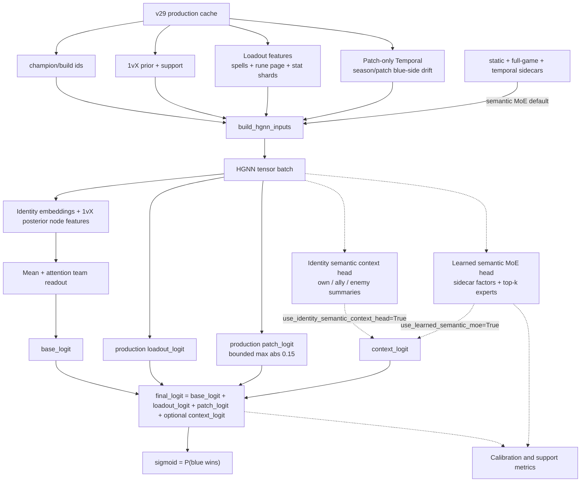
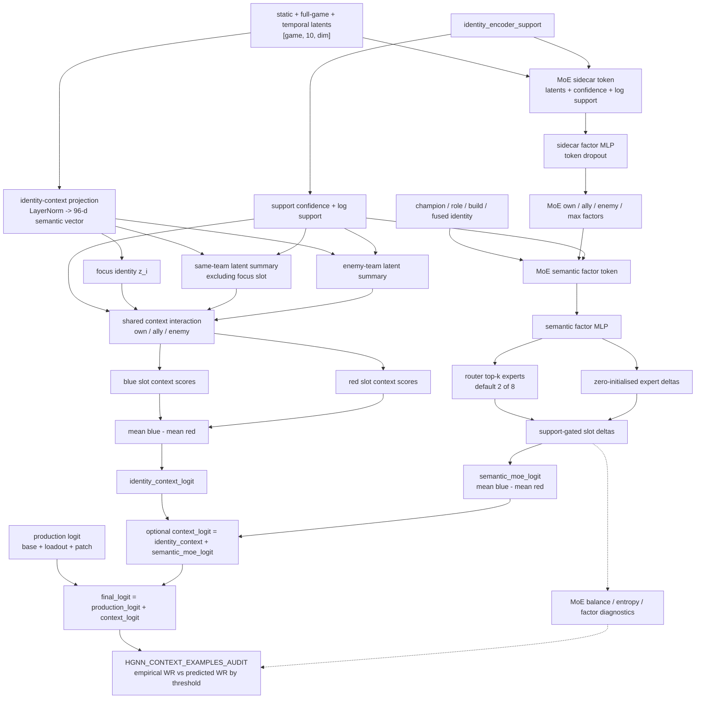

# HGNN Current State

Last updated: 2026-06-07.

## Production Path

Default training and serving use the 1vX player prior, champion/build identity
embeddings, the production Loadout head, the production patch-only Temporal
head, the promoted learned semantic MoE over all three frozen identity encoders
(`static`, `full_game`, and `temporal`), and team-swap augmentation. Legacy
classification-derived semantic, profile, and context inputs are no longer part
of `build_hgnn_inputs()` or `HGNNWinModel.forward()`.

The promoted semantic path is `convex_encoder_mix`: it consumes the static,
full-game, and temporal sidecar latents through the learned MoE plus compact
semantic group features. Production capacity is 128 experts with `top_k=32`.
The older node-init sidecar MLP flags remain off by default so the production
shape matches the tested architecture. See
[Identity Encoder Sidecars](#identity-encoder-sidecars).

```text
cache 1vX priors + support
-> posterior node features
-> champion/build identity embeddings
-> production Loadout head + patch-only Temporal head
-> frozen static/full-game/temporal sidecars into convex semantic MoE
-> blue/red team readout
-> final logit
-> sigmoid = P(blue wins)
```

Direct 1v1/2vX champion matchup and synergy relationship integrations have been
removed from the model, cache, priors, and predictor; they are no longer part of
`build_hgnn_inputs()` or `HGNNWinModel.forward()`. Loadout and patch-only
Temporal are no longer tracked as ablation families in this document; they are
part of the default production model when the v29 cache provides
`loadout_features.npy` and `patch_features.npy`.

## Production Status

Hard acceptance remains overall raw validation accuracy `>=60%` and overall raw
test accuracy `>=60%` on held-out splits. The current promoted production model
does not meet that gate yet, but it is the strongest no-relationship checkpoint
installed locally and the first production artifact to consume all three frozen
identity encoders through the semantic MoE.

Promoted checkpoint and metrics:
`app/ml/data/hgnn_production_model.pt` and
`app/ml/data/metrics_latest.json`.

Production artifact note: the installed checkpoint was promoted from the only
available local 128x32 semantic MoE artifact. Its saved config has the temporary
sparse-dispatch experiment key removed, and the maintained production runtime no
longer exposes a dense/sparse dispatch flag.

Setup: v29 production cache, compact identity encoder sidecar artifact,
production loadout head, bounded patch-only temporal head, learned semantic MoE
with `convex_encoder_mix`, `semantic_moe_num_experts=128`,
`semantic_moe_top_k=32`, compact semantic group features, raw `val_accuracy`
checkpointing, `batch_size=16384`, `max_epochs=40`, `patience=5`, learning rate
`1e-4`, seed `4`, and frozen loaded parameters from the previous production
warm start.

| Production model | Raw validation accuracy | Raw test accuracy | Validation NLL | Test NLL |
| --- | ---: | ---: | ---: | ---: |
| 1vX + champion/build + Loadout + patch Temporal + all-encoder semantic MoE (`convex_encoder_mix`, 128x32) | **57.8854%** | **57.3796%** | **0.672978** | **0.675965** |
| Previous semantic production: same path with 8x2 MoE | `57.8896%` | `57.2993%` | `0.673184` | `0.676212` |
| Previous production baseline: 1vX + champion/build + Loadout + patch-only Temporal | `57.6828%` | `57.0163%` | `n/a` | `n/a` |

Loadout uses train-only, leave-one-out-adjusted historical priors over
summoner spell pairs, broad rune setup, full rune page, secondary rune pair, and
stat shards. Rune rows are joined through `puuid` only to align the selected
rune page; no player identity is emitted, cached, or modeled. Patch Temporal is
restricted to season/patch blue-side drift only and does not include
champion-role patch deltas.

Historical comparison: the best prior full-split no-relationship residual check
was `L+S` at `57.6814%` validation / `57.0058%` test. The promoted production
checkpoint narrowly exceeds that reference without adding relationship or
matchup priors. The older broad `T+L` diagnostic washed out loadout because it
combined champion-role patch deltas with the patch blue-side intercept in one
shared residual head; production keeps only the bounded patch blue-side drift in
a separate head.

Under the current leakage policy, observed final build-value/profile residuals
remain diagnostic only unless a draft-safe source or RL search supplies the build
intent. The old build-intent probe artifacts were removed from the maintained
production workspace because they read completed-game build-profile
labels/margins and are not accepted pregame validation results.

## Architecture



## Identity Encoder Sidecars

Three standalone identity autoencoders produce latents that can be injected as
node-level sidecars in `HGNNWinModel`. The sidecar artifact is one row per
`(champion, role, build)` identity; the static block is champion-level and is
joined/repeated onto those rows, while full-game and temporal latents are native
to the full identity grain.

The latents are **not** materialised per game-slot. The cache (`v29`) records the
artifact path/dims only; `app/ml/train.py` builds an on-device gather table
(`EncoderSidecarLookup.gather_tables`) and gathers `(batch, 10, dim)` blocks per
batch from `champion_id`/`build_id` — the static block is keyed by champion. This
collapses the sidecar cache from tens of GB to the few-MB frozen artifact. The
draft-time predictor already gathered the same way. Legacy caches that still hold
per-game sidecar arrays continue to load and are used directly.

| Sidecar | Encoder module | Node-init sidecar flag (default `False`) |
| --- | --- | --- |
| Static | [classification/static_identity_encoder.py](../../classification/static_identity_encoder.py) | `use_identity_static_sidecar` |
| Full-game | [classification/full_game_encoder.py](../../classification/full_game_encoder.py) | `use_identity_full_game_sidecar` |
| Temporal | [classification/temporal_autoencoder.py](../../classification/temporal_autoencoder.py) | `use_identity_temporal_sidecar` |

The node-init sidecar MLP is support-gated and zero-initialised, so an unwired
or low-support latent is a no-op on the production node init. Those three
node-init flags remain off by default. The promoted production path consumes the
same static/full-game/temporal latents inside the learned semantic MoE instead.

`HGNNConfig.use_identity_semantic_context_head=True` enables a separate
zero-initialised context logit over the frozen static, full-game, and temporal
blocks. For each slot it projects the concatenated latents, builds support-
weighted **mean** summaries of the other four allies and five enemies plus
**extremity (max)** summaries, scores the shared `own / ally / enemy`
interaction, and adds `context_logit` to `base_logit`. The max summaries preserve
convex composition signal ("3 burst threats") that mean pooling averages away. A
learned scalar `context_scale` (init 1.0, a no-op at init because the score head
is zero-initialised) lets the optimiser grow the context correction, countering
the systematic effect-shrinkage seen in the audit. The model returns all three
columns: `base_logit`, `context_logit`, and `final_logit`.

Two report-only tuning knobs target the same audit gap without per-grouping
fitting: `--auc-ranking-loss-weight` (ranking loss that weights rare extreme
contexts equally with the common middle) and `--semantic-context-support-strength`
(lower to amplify context magnitude). Both default off/30.

`HGNNConfig.use_learned_semantic_moe=True` enables the learned mixture-of-experts
context path over the same required sidecar inputs plus the champion, role,
build, and fused identity embeddings. Production defaults enable this path with
`semantic_moe_architecture="convex_encoder_mix"`. It builds support/log-support
sidecar tokens, derives own / ally / enemy / extremity factors, routes each slot
through top-k experts (default 2 of 8), support-gates zero-initialised slot
deltas, and adds `semantic_moe_logit` into `context_logit`. It can run alone or
alongside the identity semantic context head; training consumes
`semantic_moe_regularization_loss` and reports router usage, entropy, factor
diversity, token-dropout, and delta diagnostics.

When `use_semantic_group_features=True`, the learned MoE also receives the
compact semantic group feature tensor from `app/ml/semantic_group_features.py`.
The relationship head builds slot-level own / ally / enemy group summaries
including mean, sum, max, ally-vs-enemy differences, and own-by-team interaction
blocks. A zero-initialised MLP turns those relationship blocks into support-gated
slot deltas, so the production prior is unchanged at init while identities can
slowly learn how their own semantic groups react to every allied and enemy group
composition. Diagnostics expose the relationship logit, slot-delta norm,
coefficient norm, context norm, and optional L2 penalty.

Serving rebuilds the same compact group tensor from smoothed train identity
metrics plus static champion HP/range lookups, so melee/ranged and natural
tankiness remain available without reading the large per-game
`identity_context_raw.npy` cache.

Since the context audit is slot-specific, checkpoints with MoE slot deltas are
now audited with focus-side probabilities rather than one repeated match-level
probability. Blue slots are scored in the blue frame; red slots are scored in the
mirrored red frame. `--semantic-context-calibration-loss-weight` adds a
slot-aware calibration objective over the same audit specs, with stable
train-split empirical targets and optional tail weighting, so gradients flow
directly into semantic slot deltas. The promoted production checkpoint is now
`app/ml/data/hgnn_production_model.pt`, copied from the seed-4
`convex_encoder_mix` architecture run. On the checked-in focus-slot context
audit it reports validation Gap MSE `5.39 pp^2`, mean absolute gap `1.69 pp`,
and max absolute gap `10.12 pp`; the lower-variance group EB audit is the
semantic promotion selector.

### Semantic Architecture

The production semantic MoE architecture is fixed to `convex_encoder_mix`.
Rejected architecture ablations are not part of the maintained production
surface. A production-aligned seed-trio rerun on 2026-06-06 found no replacement
that improved both held-out accuracy and context calibration strongly enough to
promote, so the service path remains the compact sidecar plus
`convex_encoder_mix` recipe documented above.

### Retired Expert-Grid Ablation Outcomes

Temporary MoE expert-count / `top_k` runners, report helpers, generated
checkpoints, and parser tests were removed from the maintained workspace on
2026-06-07 after their outcomes were captured here. These runs were research
ablations only: production remains `convex_encoder_mix` with the default
8-expert / `top_k=2` recipe until a multi-seed confirmation explicitly promotes
a replacement.

The seed-4 sweeps varied only `semantic_moe_num_experts` and
`semantic_moe_top_k`, using the compact identity sidecar, frozen production warm
start, semantic group features, focus-side context examples audit, and group EB
audit. The ablation runner used the config from `metrics_latest.json`
(`learning_rate=1e-4`, `batch_size=32768`, `max_epochs=40`, `patience=5`,
`checkpoint_metric=val_accuracy`, `semantic_context_calibration_target=group_eb`,
`semantic_context_calibration_loss_weight=10.0`), which differs from the
production defaults documented above (`3e-4`, `40960`).

Primary context ranking was the mean of validation/test flagged
support-weighted mean absolute gap from `HGNN_CONTEXT_EXAMPLES_AUDIT.md`; lower
is better.

After review, `128x32` was selected as the production capacity. The table below
is retained as the decision record; the generated ablation runners, reports, and
run directories were removed from the maintained workspace.

| Variant | Experts | `top_k` | Active fraction | Flagged MAE | Flagged MSE | Validation accuracy | Test accuracy | Validation NLL | Test NLL |
| --- | ---: | ---: | ---: | ---: | ---: | ---: | ---: | ---: | ---: |
| `128x32` | 128 | 32 | 0.250 | **1.7027 pp** | **4.8201 pp^2** | 57.8547% | 57.3433% | **0.6729** | **0.6759** |
| `32x16` | 32 | 16 | 0.500 | 1.7616 pp | 4.9456 pp^2 | 57.8715% | 57.3593% | 0.6729 | 0.6760 |
| `32x8` | 32 | 8 | 0.250 | 1.7653 pp | 4.9552 pp^2 | 57.8701% | **57.3970%** | 0.6729 | 0.6760 |
| `16x8` | 16 | 8 | 0.500 | 1.7890 pp | 5.0316 pp^2 | 57.8589% | 57.3712% | 0.6729 | 0.6760 |
| `64x32` | 64 | 32 | 0.500 | 1.9191 pp | 5.8366 pp^2 | 57.8575% | 57.3579% | 0.6730 | 0.6760 |
| `64x16` | 64 | 16 | 0.250 | 1.9395 pp | 5.9308 pp^2 | 57.8547% | 57.3433% | 0.6731 | 0.6761 |
| `128x16` | 128 | 16 | 0.125 | 1.9599 pp | 6.2078 pp^2 | 57.8155% | 57.3241% | 0.6733 | 0.6762 |
| `32x4` | 32 | 4 | 0.125 | 1.9669 pp | 5.7403 pp^2 | **57.8994%** | 57.3712% | 0.6730 | 0.6760 |
| `64x8` | 64 | 8 | 0.125 | 1.9822 pp | 6.1229 pp^2 | 57.8673% | 57.3579% | 0.6731 | 0.6760 |
| `8x2` control | 8 | 2 | 0.250 | 1.9989 pp | 6.2255 pp^2 | 57.8575% | 57.3489% | 0.6730 | 0.6760 |

Against the `8x2` in-sweep control, `128x32` reduced flagged context MAE by
0.2961 pp (14.8%) and flagged context MSE by 1.4054 pp^2 (22.6%). Accuracy was
effectively flat (`-0.000028` validation, `-0.000056` test), while NLL improved
slightly on both validation and test. Against the cheaper `16x8` candidate,
`128x32` still reduced flagged context MAE by 0.0863 pp (4.8%) and flagged MSE
by 0.2115 pp^2 (4.2%), but test accuracy was lower by 0.000279.

The larger-capacity signal was promising but not monotonic: `64x*`
underperformed the best `32x*` and `128x32`, while `128x16` underperformed
`128x32`. The interrupted `128x64` run was stopped before metrics/audits
completed and is not a result.

### Pruned Sparse Follow-Up

A temporary sparse-capacity follow-up completed the available 128x32 checkpoint
now installed as production and started `256x64`, which was interrupted after
epoch 5 because it was slower than 128x32 and did not beat the sparse-compatible
128x32 control on validation accuracy. The completed 128x32 follow-up reported
validation/test accuracy `57.8854%` / `57.3796%`, validation/test NLL
`0.672978` / `0.675965`, validation/test context mean absolute gap `1.78 pp` /
`1.72 pp`, and validation/test context Gap MSE `5.97 pp^2` / `5.40 pp^2`.
The six flagged audit examples averaged flagged support-weighted MAE
`2.1713 pp` and flagged support-weighted MSE `6.3010 pp^2` across
validation/test.

That sparse-dispatch implementation, its CLI flag, runner/report helpers,
tests, and generated experiment outputs have been removed. Production retains
the standard dense MoE execution path with 128 experts and `top_k=32`.

### Semantic Context Plan



## Maintained Surfaces

| File | Purpose |
| --- | --- |
| [../hgnn_model.py](../hgnn_model.py) | HGNN model, input builder, swap invariants, and optional semantic/context heads. |
| [../encoder_sidecar.py](../encoder_sidecar.py) | Identity-encoder latent loading, per-game lookup, and dedup gather tables. |
| [../loadout_patch_features.py](../loadout_patch_features.py) | Production train-only loadout priors and patch-only temporal feature extraction. |
| [../build_dataset.py](../build_dataset.py) | Cache builder for 1vX identity inputs and sidecar metadata. |
| [../dataset.py](../dataset.py) | Cache loader and split dataclass. |
| [../train.py](../train.py) | Production training and validation/report-only calibration diagnostics. |
| [../predictor.py](../predictor.py) | Draft-time runtime bridge. |

## Throughput Default

Use `--batch-size 40960` for every HGNN experiment unless the experiment is
explicitly a throughput/allocator sweep. The archived local RTX 5070 Ti sweep
found batch `40960` as the peak stable point at `135,014`
team-swap-augmented samples/s (`67,507` raw rows/s). Larger tested batches
regressed:

| Batch size | Augmented samples/s | Raw rows/s |
| ---: | ---: | ---: |
| `32768` | `120,960` | `60,480` |
| `40960` | **`135,014`** | **`67,507`** |
| `41984` | `102,908` | `51,454` |
| `43008` | `97,181` | `48,590` |
| `49152` | `62,598` | `31,299` |

## Active Defaults

| Area | Default |
| --- | --- |
| Checkpoint metric | `val_accuracy` |
| Training batch size / throughput | `40960`; `135,014` augmented samples/s on the local RTX 5070 Ti sweep. |
| Learning rate / patience / weight decay | `3e-4` / `5` / `0.0` |
| Report-only temperature scaling | Fit on validation logits only; never changes served probabilities. |
| Direct 1v1/2vX integrations | Removed from the model, cache, priors, and predictor. |
| Loadout head | Production-on with v29 cache metadata and `loadout_features.npy`. |
| Patch-only Temporal head | Production-on with v29 cache metadata and `patch_features.npy`; season/patch blue-side drift only. |
| Identity-encoder node-init sidecar MLPs (static/full-game/temporal) | Disabled by default. |
| Identity semantic context head over all three identity sidecars | Disabled by default. |
| Learned semantic MoE head over all three identity sidecars | Enabled by default with `convex_encoder_mix`. |
| Semantic group features and relationship head | Enabled by default for the learned semantic MoE. |
| Semantic context calibration loss | Disabled by default; research/audit optimization only. |

Invalid calibration and training config combinations fail early in
`app/ml/train.py`. Test labels are not used for threshold selection,
temperature fitting, checkpoint selection, or model selection.
